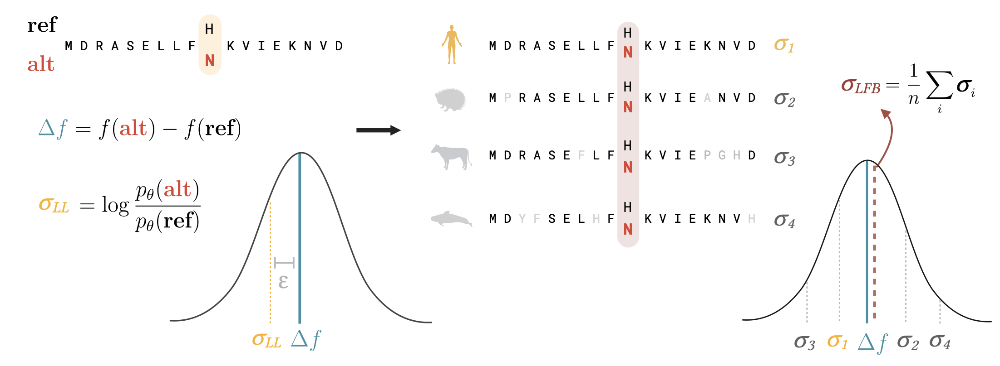

# Likelihood Fitness Bridging (LFB)



## Installation

```bash
conda create --name lfb python=3.11 mmseqs2 -c conda-forge -c bioconda
conda activate lfb
pip install . 
```

For running Evo 2 predictions, install according to instructions in the [repo](https://github.com/ArcInstitute/evo2) and ensure HAL Tools are installed - see the [repo](https://github.com/ComparativeGenomicsToolkit/hal) or [Cactus](https://github.com/ComparativeGenomicsToolkit/cactus/releases) for binaries.

## Running LFB
### For protein language models

#### `./scripts/plm/predict_lfb.py`
Input: 
- `--tsv_alignment_file`: a tsv file (as produced by `mmseqs covertalis`), with no header, with at least the fields: `query`, `target`, `qstart`, `qend`, `tstart`, `tend`, `cigar`, `qseq`, `tseq`. These can be produced using `./scripts/plm/produce_alignment.sh`. Note the query should be the sequence for scoring.


- `--model`: a huggingface path to an ESM style model, or a path to a progen model if the flag `--progen` is provided.

Output:
- `--output`: a csv file of model predictions across variants of the protein - all possible point mutations unless `--variants_table` is provided.

Example: 
```bash
python ./scripts/plm/predict_lfb.py \
    --tsv_alignment_file "./data/test_data/BLAT_ECOLX_Stiffler_2015.tsv" \
    --output "./data/test_data/test_output.csv" \
    --model "facebook/esm2_t6_8M_UR50D" \
    --inference_mode "masked-marginals" \
    --percentage_identity "0.3" \
    --random_subsample_num "10"
```


Alignment Filtering and Random Subsampling:

- `--coverage`: sets a minimum coverage threshold, ensuring that only sequences covering a sufficient portion of the query are used.
- `--percentage_identity`: filters based on the minimum acceptable identity fraction, so only sequences similar enough to the query are considered.
- `--random_subsample_num`: allows you to randomly select a subset of the filtered alignment (including the query) - almost equivalent performance can be seen with values as low as 10 or 15.


### For genomic languague models

See the scripts in `./scripts/glm`

- `1_make_bed_from_vcf.py`: Create a bed file, usable with hal liftover of the loci of variants in a vcf file. 

- `2_liftover_to_zoonomia`: Mapping over the bed file of variants to other species in hal alignment using hal liftover.

- `3_get_sequences.py`: Extracting sequences centered around variants using lifted-over variants to a fasta file.

- `4_score_evo.py`: Score the variants in given fasta file using evo2.

## References

MMseqs

https://github.com/soedinglab/MMseqs2

Zoonomia

https://zoonomiaproject.org

Hal toolkit

https://github.com/ComparativeGenomicsToolkit/hal

Evo 2

https://github.com/ArcInstitute/evo2

ProGen2

https://github.com/enijkamp/progen2

ESM-2

https://github.com/facebookresearch/esm

and on huggingface,

https://huggingface.co/facebook/esm2_t6_8M_UR50D

## Preprint

The preprint for LFB is available [here](https://www.biorxiv.org/content/10.1101/2025.05.20.655154v1.full).
